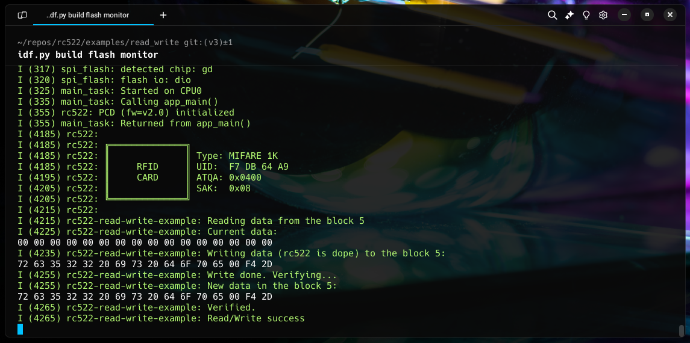

# esp-idf-rc522

 [](https://components.espressif.com/components/abobija/rc522)

This repository contains [ESP-IDF](https://github.com/espressif/esp-idf) library (component) for communication with RFID cards using [MFRC522](https://www.nxp.com/docs/en/data-sheet/MFRC522.pdf) reader.



Library takes care of polling the cards and managing the card lifecycle. It also fires events when a card is detected, removed, or when the card changes to any state described in ISO-14443. Additionally, it provides an API for reading and writing to card memory blocks.

## Installation

To install latest version of this component to your project, run:

```bash
idf.py add-dependency "abobija/rc522"
```

Read more about esp-idf component manager in [official documentation](https://docs.espressif.com/projects/esp-idf/en/stable/esp32/api-guides/tools/idf-component-manager.html).

## Support

- Cards: `MIFARE 1K`, `MIFARE 4K` and `MIFARE Mini`
- Card operations:
    - Read and write to memory blocks ([example](examples/read_write))
- Communication protocols: `SPI` and `I2C`
- ESP-IDF version: `^5`

## Create project from example

> [!TIP]
> To find more interesting examples (like [`memory_dump`](examples/memory_dump)), go to [examples](examples) folder.

To run [`basic`](examples/basic) example, create it as follows:

```bash
idf.py create-project-from-example "abobija/rc522:basic"
```

Then build and flash it as usual:

```bash
cd basic
idf.py build flash monitor
```

> [!NOTE]
> [`basic`](examples/basic) example uses SPI communication. Find defined GPIO configuration in [basic.c](examples/basic/main/basic.c) file.

## Pin Layout

Pin layout is configurable by the user. To configure the GPIOs, check the `#define` statements in the [basic example](examples/basic/main/basic.c). If you are not using the RST pin, you can connect it to the 3.3V.

## Unit testing

To run unit tests, go to [`test`](test) directory and set target to `linux`:

```bash
cd test
idf.py --preview set-target linux
```

Then build the project and run tests:

```bash
idf.py build && ./build/test.elf
```

## Security

- Mifare Classic cards use the Crypto-1 cipher for authentication and encryption, which has been [broken](https://eprint.iacr.org/2008/166) for a long time. As a result, it is not advisable to use Mifare Classic cards for security-sensitive applications. Instead, consider using Mifare Plus or Desfire cards, which utilize AES encryption.
- Even though block zero, which contains the UID, is typically considered as read-only, there are certain cards known as "magic" or "Chinese magic" cards that can be used to modify the UID. As a result, relying on the UID of a card as a secure identifier is not recommended.

## Terms

| Term | Description |
| ---- | ----------- |
| PCD  | Proximity Coupling Device (the card reader). In our case this is MFRC522 module |
| PICC | Proximity Integrated Circuit Card (e.g: rfid card, tag, ...) |

## References

- [ISO/IEC 14443](https://en.wikipedia.org/wiki/ISO/IEC_14443) Identification cards - Contactless integrated circuit cards
- [ISO/IEC 14443-2](http://www.emutag.com/iso/14443-2.pdf) Radio frequency power and signal interface
- [ISO/IEC 14443-3](http://www.emutag.com/iso/14443-3.pdf) Initialization and anticollision
- [ISO/IEC 14443-4](http://www.emutag.com/iso/14443-4.pdf) Transmission protocol
- [MFRC522](https://www.nxp.com/docs/en/data-sheet/MFRC522.pdf) MFRC522 - Standard performance MIFARE and NTAG frontend
- [AN10833](https://www.nxp.com/docs/en/application-note/AN10833.pdf) MIFARE type identification procedure
- [AN10834](https://www.nxp.com/docs/en/application-note/AN10834.pdf) MIFARE ISO/IEC 14443 PICC selection
- [MF1S50YYX_V1](https://www.nxp.com/docs/en/data-sheet/MF1S50YYX_V1.pdf) MIFARE Classic EV1 1K
- [MF1S70YYX_V1](https://www.nxp.com/docs/en/data-sheet/MF1S70YYX_V1.pdf) MIFARE Classic EV1 4K

## License

This component is provided under Apache 2.0 license, see [LICENSE](LICENSE) file for details.
